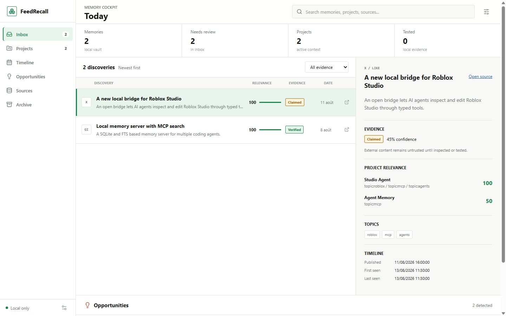

# FeedRecall

[](https://github.com/Paoladev45/feedrecall/actions/workflows/ci.yml)
[](LICENSE)
[](https://nodejs.org/)
[](https://modelcontextprotocol.io/)
[](https://github.com/Paoladev45/feedrecall/stargazers)

**Your feed is an inbox, not a knowledge base.**

FeedRecall turns human-selected likes, bookmarks, saved links, repositories, videos, and articles into persistent project-aware memory for AI agents. It runs locally, keeps an evidence trail, and exposes the same memory to Codex, Claude Code, Cursor, and other MCP clients.

No X API. No cloud account. No telemetry. Your archive stays on your machine.

> Early public alpha: the local core is usable today, while connectors and enrichment workflows are still growing.



## Try it in one minute

The interactive demo uses only synthetic records and creates its vault in a temporary directory. It never reads your browser, X account, cookies, or private files.

```bash
corepack enable
pnpm install --frozen-lockfile
pnpm demo
```

Open the URL printed by the command to inspect the inbox, evidence states, project relevance, timeline, and review queue. The demo automatically chooses the next free local port when `4173` is already in use. Press `Ctrl+C` to stop the local cockpit.

## Why

Saving a discovery is only the beginning:

```text
capture -> enrich -> classify -> connect to projects -> verify -> test -> adopt or reject
```

FeedRecall remembers both what a source claimed and what you or your agents later observed. Six months later, an agent can avoid recommending a tool that already failed your Windows test.

## What makes it different

FeedRecall is not another generic "store a note, retrieve a note" memory server:

- **Human-curated input:** your like or bookmark is the intent signal; the system does the organizing.
- **Project-aware memory:** one discovery can be relevant to Roblox, agent tooling, or several projects at once.
- **Evidence lifecycle:** claimed, observed, verified, tested, adopted, rejected, and replaced are distinct states.
- **Time-aware review:** publication, capture, and last-seen dates stay separate; volatile offers can be reviewed without deleting durable concepts.
- **Agent-ready output:** Codex, Claude Code, Cursor, and other MCP clients receive bounded, sourced context instead of an unfiltered archive.

The goal is simple: recover a useful discovery in seconds, then remember what happened when you actually tried it.

## Quick start

The demo vault is synthetic. It never touches your social accounts.

```bash
corepack enable
pnpm install --frozen-lockfile
pnpm run build
pnpm feedrecall init
pnpm feedrecall import examples/discoveries.json
pnpm feedrecall import-projects examples/projects.json
pnpm feedrecall search "Roblox MCP"
pnpm feedrecall recall "MCP memory" --project agent-memory
pnpm feedrecall context --project agent-memory --output context/agent-memory.md
pnpm feedrecall timeline --date-field published --group-by month
pnpm feedrecall serve
```

For the complete walkthrough, see [the one-minute demo](docs/DEMO.md).

The canonical database is `~/.feedrecall/feedrecall.db`, so local agents share one memory even when
they run from different project folders. Set `FEEDRECALL_HOME` only when you intentionally want an
isolated vault.

Optional local enrichment requires [Ollama](https://ollama.com/) and a local model:

```bash
ollama pull qwen3:4b
pnpm feedrecall process --model qwen3:4b
```

Then connect the local MCP server:

```bash
pnpm feedrecall install-client codex
pnpm feedrecall install-client claude
pnpm feedrecall install-client cursor
```

Agents can use `memory_recall` to recover a forgotten discovery and
`memory_context_pack` to load a bounded project brief with sources, dates, and
evidence status. `memory_timeline` groups the same memories by publication,
capture, or observation date. The equivalent CLI commands are:

```bash
pnpm feedrecall recall "the MCP memory tool I saw last month" --project agent-memory
pnpm feedrecall context --project agent-memory --output context/agent-memory.md
pnpm feedrecall timeline --date-field first_seen --group-by week
```

See [the MCP client guide](docs/CLIENTS.md) for Codex, Claude Code, Cursor, Claude Desktop, Cline, Gemini CLI, OpenCode, and other stdio-compatible clients.

## Reproducible benchmark

Run the benchmark locally with synthetic data:

```bash
pnpm benchmark
```

It builds the core, imports 1,000 deterministic records into a temporary vault, measures import, search, recall, and timeline latency, then reports the database size. The benchmark does not make network requests or read personal data. Results depend on your machine, so the command is the source of truth.

## What v0.1 includes

- Local SQLite storage and full-text search.
- Idempotent JSON and URL imports.
- Processing, evidence, and decision lifecycles.
- Projects with transparent relevance scores.
- Timeline views grouped by day, week, or month using published, first-seen, and last-seen dates.
- Recall forgotten discoveries with project-aware evidence ranking.
- Generate compact Markdown context packs for individual projects.
- Read/write MCP tools with explicit annotations.
- Local dashboard and browser capture extension.
- Optional local enrichment through Ollama; core features work without it.

## Capture without the X API

FeedRecall does not require the paid X API. Load the unpacked extension from `extension/`, open your Likes or Bookmarks page while already signed in, and export the posts visible in your browser. FeedRecall never asks for your X password and never stores browser cookies.

The extension captures only posts currently rendered in the page. Scroll, scan, export, then import
the JSON. Repeating the flow is safe: stable source identifiers prevent duplicate memories while
`firstSeenAt` and `lastSeenAt` preserve the timeline.

Public post URLs can also be enriched with local collectors such as `gallery-dl` and `yt-dlp`. Network sources are treated as untrusted data, never executable instructions.

## Privacy

- Local-first by default; no telemetry.
- No remote model provider in the core application.
- Tokens, cookies, and passwords are not accepted in imports.
- The public repository contains only synthetic examples.
- Destructive social cleanup is intentionally outside v0.1.

## Current status

The public alpha already includes the local store, browser capture extension, timeline, recall, project context packs, MCP tools, and explainable freshness review. It does not claim to be an autonomous truth oracle: external release, pricing, or changelog verification is a planned enrichment step.

## Roadmap

- **v0.1 Memory:** import, enrich, classify, search, timeline, MCP.
- **v0.2 Projects:** project objects, context packs, collections, stronger relevance.
- **v0.3 Intelligence:** opportunities, experiments, decisions, agent feedback loop.
- **v1 Knowledge OS:** discover, understand, suggest, test, implement, remember.

See [docs/PRODUCT_PLAN.md](docs/PRODUCT_PLAN.md) for the product model and release plan, and
[docs/ROADMAP.md](docs/ROADMAP.md) for acceptance criteria and boundaries.

## Architecture

```text
Browser / JSON / URL connectors
              |
              v
        SQLite + FTS5
              |
      +-------+--------+
      |                |
 Local cockpit     MCP server
                       |
          Codex / Claude Code / Cursor
```

ChatGPT desktop, Codex CLI, and the Codex IDE extension share the same local MCP configuration, as
described in the [official Codex MCP documentation](https://learn.chatgpt.com/codex/extend/mcp).
ChatGPT web requires a future remote, authenticated plugin and is intentionally outside this
local-first release.

## Contributing and security

See [CONTRIBUTING.md](CONTRIBUTING.md) and [SECURITY.md](SECURITY.md). Never attach a real personal
vault or browser export to a public issue.

If FeedRecall helps you recover one forgotten tool or decision, starring the repository and sharing a reproducible use case are the most useful ways to support it.

## License

Apache-2.0
